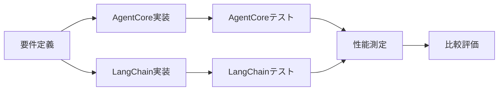

# AWS Bedrock AgentCore と LangChain系サービスの包括的比較分析

## 📋 目次

1. [はじめに](#1-はじめに)
2. [AWS Bedrock AgentCore 9サービス概要](#2-aws-bedrock-agentcore-9サービス概要)
3. [LangChainエコシステム 4サービス概要](#3-langchainエコシステム-4サービス概要)
4. [詳細比較マトリクス表](#4-詳細比較マトリクス表)
5. [機能マッピング分析](#5-機能マッピング分析)
6. [主要差別化要因](#6-主要差別化要因)
7. [利用シーン別推奨事項](#7-利用シーン別推奨事項)
8. [統合パターン分析](#8-統合パターン分析)
9. [コスト・ROI分析](#9-コスト・roi分析)
10. [それぞれでしかできない独自機能・ロジック詳細比較](#10-それぞれでしかできない独自機能・ロジック詳細比較)
11. [結論とまとめ](#11-結論とまとめ)
12. [実装サンプル検証のベストプラクティス](#12-実装サンプル検証のベストプラクティス)

---

## 🔥 2025年12月 re:Invent 最新情報ハイライト

### AWS Bedrock AgentCore 重要アップデート

| 新機能                          | ステータス | 影響度     | 概要                                            |
| ------------------------------- | ---------- | ---------- | ----------------------------------------------- |
| **Policy**                | Preview    | ⭐⭐⭐⭐⭐ | Cedar統合、自然言語ポリシー定義でガバナンス強化 |
| **Evaluations**           | Preview    | ⭐⭐⭐⭐⭐ | 13種の評価器、CloudWatch統合で品質管理          |
| **Memory Episodic**       | GA         | ⭐⭐⭐⭐   | エピソードベース学習で継続的改善                |
| **Runtime Bidirectional** | GA         | ⭐⭐⭐⭐   | 双方向音声ストリーミングで自然な会話            |
| **MCP統合**               | GA         | ⭐⭐⭐     | Model Context Protocol完全サポート              |

### LangChain エコシステム 重要アップデート

| 新機能                          | ステータス  | 影響度     | 概要                                         |
| ------------------------------- | ----------- | ---------- | -------------------------------------------- |
| **LangChain 1.1**         | GA          | ⭐⭐⭐⭐⭐ | Model Profiles、ミドルウェア強化で信頼性向上 |
| **LangGraph 1.0 GA**      | GA          | ⭐⭐⭐⭐⭐ | 初の安定版、プロダクション対応完了           |
| **Agent Builder**         | Public Beta | ⭐⭐⭐⭐   | LangSmithでノーコードエージェント開発        |
| **Unified Cost Tracking** | GA          | ⭐⭐⭐⭐   | フルスタックコスト可視化                     |
| **Deep Agents Sandboxes** | GA          | ⭐⭐⭐     | リモートサンドボックス実行                   |

### 比較のポイント（2025年12月版）

#### AgentCoreの新たな強み

- ✅ **Policy (Preview)**: エンタープライズガバナンスで圧倒的優位
- ✅ **Evaluations (Preview)**: 品質管理がネイティブ統合
- ✅ **双方向音声**: ボイスエージェントに最適

#### LangChainの新たな強み

- ✅ **LangChain 1.1**: Model Profilesで信頼性大幅向上
- ✅ **LangGraph 1.0 GA**: プロダクション環境での安心感
- ✅ **Agent Builder**: 非開発者でもエージェント構築可能

---

## 1. はじめに

本ドキュメントでは、AWS Bedrock AgentCoreの9つのサービスコンポーネントと、LangChainエコシステムの4つの主要サービス（LangGraph、LangChain、LangFuse、LangSmith）について包括的な比較分析を実施します。

**🆕 2025年12月版の特徴**:

- ✅ AWS re:Invent 2025の最新発表を完全反映
- ✅ AgentCore Policy/Evaluations（Preview）の詳細解説
- ✅ LangChain 1.1、LangGraph 1.0 GAの新機能分析
- ✅ 実装サンプル検証のベストプラクティス

この比較は、企業や開発者がAIエージェントプラットフォームの選択を行う際の意思決定支援を目的としており、2025年12月時点の公式ドキュメントや実装サンプルに基づいた正確な技術情報を提供します。

## 2. AWS Bedrock AgentCore 9サービス概要

Amazon Bedrock AgentCoreは、AIエージェントの構築、デプロイ、運用を行うためのモジュラー型プラットフォームです。以下の9つのコアサービスで構成されています。

**🆕 2025年12月 re:Invent アップデート**: Policy、Evaluations、Memory Episodic functionality、Runtime Bidirectional streamingが追加・強化されました。

### 2.1 コアサービス一覧

| サービス                   | 説明                                                      | 最新アップデート                                                   |
| -------------------------- | --------------------------------------------------------- | ------------------------------------------------------------------ |
| **Runtime**          | AIエージェントとツールをホストするサーバーレス実行環境    | 🆕**Bidirectional streaming** - 双方向音声ストリーミング対応 |
| **Memory**           | 短期・長期メモリ管理による文脈認識機能                    | 🆕**Episodic functionality** - エピソードベース学習機能      |
| **Gateway**          | API、Lambda関数をMCP対応ツールに変換                      | 🆕**MCP統合** - Model Context Protocol完全サポート           |
| **Identity**         | エージェント用のアイデンティティ・アクセス管理            | 安定版                                                             |
| **Code Interpreter** | コード実行用の隔離されたサンドボックス環境（最大8時間）   | 安定版                                                             |
| **Browser**          | Webアプリケーション操作用のクラウドブラウザ環境           | 安定版                                                             |
| **Observability**    | 統合されたトレース、デバッグ、監視機能                    | Evaluationsと統合強化                                              |
| **Evaluations** 🆕   | リアルワールド性能に基づくエージェント品質評価（Preview） | 🆕**13種類のビルトイン評価器**、カスタム評価器作成可能       |
| **Policy** 🆕        | ビジネスルールとガバナンスによる制御機能（Preview）       | 🆕**Cedar統合**、自然言語ポリシー定義、リアルタイム実行      |

### 2.2 re:Invent 2025 での主要発表事項

#### Policy (Preview) - ガバナンス強化

- **Cedar ポリシー言語統合**: AWSネイティブのポリシー言語でセキュリティ定義
- **自然言語ポリシー定義**: コード不要でビジネスルールを記述可能
- **リアルタイムポリシーチェック**: Gateway統合でツール呼び出し前に自動検証
- **独立した検証レイヤー**: エージェントの推論ループ外で動作し、信頼性向上

**実装例**:

```cedar
permit(
  principal is AgentCore::OAuthUser,
  action == AgentCore::Action::"RefundTool__process_refund",
  resource == AgentCore::Gateway::"<GATEWAY_ARN>"
)
when {
  principal.hasTag("role") &&
  principal.getTag("role") == "refund-agent" &&
  context.input.amount < 200  // $200未満の返金のみ許可
};
```

#### Evaluations (Preview) - 品質評価システム

- **13種類のビルトイン評価器**:
  - Correctness（正確性）
  - Helpfulness（有用性）
  - Faithfulness（忠実性）
  - Harmfulness（有害性）
  - Stereotyping（ステレオタイプ検出）
  - Tool selection accuracy（ツール選択精度）
  - Context relevance（文脈関連性）等
- **カスタム評価器**: ビジネス固有の品質基準を定義可能
- **CloudWatch統合**: Observabilityダッシュボードで統一監視
- **アラート機能**: 品質メトリクスが閾値を下回った際の自動通知

#### Memory - Episodic functionality

- **エピソードベース学習**: 過去の経験を構造化して記録
- **パターン認識**: 類似タスクでの学習内容を自動適用
- **Reflection Agent**: エピソードから洞察を抽出
- **コンテキスト最適化**: 必要な学習内容のみを注入し、プロンプト効率化

#### Runtime - Bidirectional streaming

- **双方向音声対応**: ユーザーとエージェントが同時に話せる自然な会話
- **中断処理**: ユーザーの発言でエージェントの応答を即座に変更可能
- **コンテキスト維持**: 会話の流れを保ちながら動的に対応
- **インフラ管理不要**: 複雑な双方向通信の実装をAWSが管理

### 2.3 採用実績（2025年12月時点）

- **PGA TOUR**: コンテンツ生成速度1000%向上、コスト95%削減
- **Workday**: 金融計画分析時間30%削減、月100時間節約
- **Grupo Elfa**: 100%のトレーサビリティ達成、問題解決時間50%短縮
- **SDK ダウンロード数**: 5ヶ月で200万回以上

## 3. LangChainエコシステム 4サービス概要

LangChainエコシステムは、大規模言語モデル（LLM）ベースのアプリケーション開発のための包括的なツールセットを提供します。

**🆕 2025年12月アップデート**: LangChain 1.1、LangGraph 1.0 GA、LangSmith Agent Builder（Public Beta）がリリースされました。

### 3.1 主要サービス

| サービス            | 説明                                                                               | 最新アップデート                                                                |
| ------------------- | ---------------------------------------------------------------------------------- | ------------------------------------------------------------------------------- |
| **LangChain** | LLMアプリケーション開発のためのメインフレームワーク                                | 🆕**v1.1** - Model Profiles、スマート要約、ミドルウェア強化               |
| **LangGraph** | 複雑な状態管理とワークフロー制御のための低レベルオーケストレーションフレームワーク | 🆕**v1.0 GA** - プロダクション対応安定版、初のメジャーリリース            |
| **LangFuse**  | LLMアプリケーションのオブザーバビリティ・評価プラットフォーム                      | 安定版                                                                          |
| **LangSmith** | LangChain公式の開発・デバッグ・デプロイツール                                      | 🆕**Agent Builder (Public Beta)** - ノーコード開発、Unified Cost Tracking |

### 3.2 2025年12月の主要アップデート

#### LangChain 1.1 - エージェント開発の信頼性向上

**Model Profiles（新機能）**

```python
# モデルの機能を自動検出
model = ChatAnthropic(model="claude-3-5-sonnet-20241022")
print(model.profile)
# → 構造化出力、関数呼び出し、JSONモードなどのサポート状況を確認
```

- **models.dev 統合**: オープンソースのモデル能力データベースから自動取得
- **宣言的な機能確認**: 各プロバイダーの機能差異を透過的に扱える
- **構造化出力の自動選択**: モデルプロファイルからベスト戦略を推論

**スマート要約ミドルウェア**

- Model Profilesを活用して最適なタイミングと方法で要約
- プロバイダー固有の挙動に対応
- 長時間実行エージェントセッションでのパフォーマンス向上

**構造化出力の改善**

- `ProviderStrategy`（ネイティブ構造化出力）をModel Profilesから自動推論
- プロバイダーロジックのハードコーディング不要
- 型付き結果の信頼性向上

**SystemMessage サポート**

```python
from langchain_core.messages import SystemMessage

agent = create_agent(
    model=model,
    tools=tools,
    system_prompt=SystemMessage(
        content="あなたは親切なアシスタントです",
        cache_control={"type": "ephemeral"}  # キャッシュ制御ブロック
    )
)
```

**新しいミドルウェア**

- **Model Retry Middleware**: 指数バックオフによる自動リトライ
- **Content Moderation Middleware**: OpenAIモデレーションをユーザー入力・応答・ツール出力に適用

#### LangGraph 1.0 GA - プロダクション対応の状態管理

- **初の安定メジャーリリース**: 本番環境での信頼性を保証
- **Durable Execution**: 長時間実行タスクの信頼性向上
- **Time-Travel Debugging**: 本番品質のデバッグ機能
- **Hierarchical Agents**: Supervisor Patternの標準化

#### LangSmith アップデート

**Agent Builder (Public Beta)**

- ノーコードでエージェント構築
- 開発者以外（ビジネスユーザー）がエージェント作成可能
- プロンプト、ツール、ワークフローをGUIで設定
- プロダクション対応エージェントを短時間で構築

**Unified Cost Tracking**

```python
# LLM、ツール、検索すべてのコストを統一追跡
from langsmith import Client

client = Client()
# フルスタックでコスト可視化
# - モデル呼び出しコスト
# - ツール実行コスト
# - RAG検索コスト
```

**Multi-turn Evaluations**

- エンドツーエンドのエージェント対話を評価
- 単一ターンではなく、会話全体のパフォーマンス測定
- オンライン評価に対応

**Okta SCIM + SSO Integration**

- Okta Integration Network (OIN) に正式対応
- エンタープライズ向けアクセス管理の簡素化

#### Deep Agents アップデート

**Sandboxes サポート**

```python
from deepagents import create_deep_agent

agent = create_deep_agent(
    tools=[custom_tools],
    sandbox="e2b"  # リモートサンドボックスで実行
)
# 安全で隔離された、再現可能な実行環境
```

- **リモートサンドボックス実行**: E2B等のサンドボックスプロバイダー統合
- **安全性向上**: コード実行を隔離環境で実施
- **再現性**: 一貫した実行環境の保証

### 3.3 エコシステム全体の進化

- **LangChain 200万回以上のダウンロード/月**
- **LangGraph**: エージェント向けデファクトスタンダードフレームワーク
- **LangSmith**: 10万人以上の開発者が利用
- **オープンソースコミュニティ**: 活発な開発と貢献継続

## 4. 詳細比較マトリクス表

### 4.1 AgentCore サービス比較（2025年12月版）

| サービス名                           | 主な目的                  | 主要機能（🆕=2025新機能）                                                                                          | ユースケース                                             | 統合/互換性                               | デプロイメント        |
| ------------------------------------ | ------------------------- | ------------------------------------------------------------------------------------------------------------------ | -------------------------------------------------------- | ----------------------------------------- | --------------------- |
| **AgentCore Runtime**          | AIエージェント実行環境    | サーバーレス実行、セッション分離、マルチモーダル対応<br/>🆕 **双方向ストリーミング**（音声エージェント対応） | カスタマーサポート、音声対話システム、ワークフロー自動化 | CrewAI、LangGraph、LlamaIndex、OpenAI SDK | フルマネージド、AWS内 |
| **AgentCore Memory**           | 文脈認識機能              | 短期・長期メモリ、エージェント間メモリ共有<br/>🆕 **エピソード機能**（経験ベース学習）                       | 対話型アプリケーション、パーソナライゼーション、継続学習 | LangGraph、LangChain、LlamaIndex          | マネージドサービス    |
| **AgentCore Gateway**          | APIツール変換             | 🆕**MCP完全対応**、API変換、認証情報管理、Policy統合                                                         | 既存システム統合、ツール統一、MCP server展開             | MCP、Lambda、OpenAPI                      | フルマネージド        |
| **AgentCore Identity**         | アイデンティティ管理      | IdP統合、認証、アクセス制御、ワークロードID                                                                        | エンタープライズ統合、セキュアアクセス                   | Cognito、Okta、Azure AD                   | マネージドサービス    |
| **AgentCore Code Interpreter** | コード実行環境            | 隔離サンドボックス、多言語対応、VPC統合、**最大8時間実行**                                                   | データ分析、計算タスク、長時間処理                       | Python、JavaScript、TypeScript            | サーバーレス          |
| **AgentCore Browser**          | Web操作環境               | クラウドブラウザ、自動化、VPC対応                                                                                  | Web操作、情報抽出、E2Eテスト                             | Playwright、BrowserUse                    | フルマネージド        |
| **AgentCore Observability**    | 監視・分析                | トレース、デバッグ、可視化、🆕**Evaluations統合**                                                            | 本番環境監視、品質管理                                   | OpenTelemetry互換、CloudWatch             | 統合型                |
| **AgentCore Evaluations** 🆕   | 品質評価（Preview）       | 🆕**13種のビルトイン評価器**（Correctness, Helpfulness等）<br/>カスタム評価器、リアルタイム評価、アラート    | 品質管理、継続改善、SLA監視                              | CloudWatch統合、カスタムモデル            | フルマネージド        |
| **AgentCore Policy** 🆕        | ガバナンス制御（Preview） | 🆕**Cedar統合**、自然言語ポリシー定義、リアルタイム実行<br/>MCP Policy Authoring Server                      | コンプライアンス、制御、ガバナンス                       | Gateway統合、AI Coding環境                | マネージドサービス    |

### 4.2 Lang系サービス比較（2025年12月版）

| サービス名                    | 主な目的               | 主要機能（🆕=2025新機能）                                                                                                                                                                                                                                  | ユースケース                                            | 統合/互換性                                   |
| ----------------------------- | ---------------------- | ---------------------------------------------------------------------------------------------------------------------------------------------------------------------------------------------------------------------------------------------------------- | ------------------------------------------------------- | --------------------------------------------- |
| **LangChain 1.1** 🆕    | LLMアプリ開発          | コンポーネント連携、RAG、エージェント<br/>🆕 **Model Profiles**（models.dev統合）<br/>🆕 **スマート要約ミドルウェア**<br/>🆕 **構造化出力改善**<br/>🆕 **SystemMessage対応**<br/>🆕 **リトライ・モデレーションミドルウェア** | シンプル～中規模LLMアプリ、信頼性重視のエージェント     | 豊富なLLMプロバイダー、MCP対応                |
| **LangGraph 1.0 GA** 🆕 | 複雑なワークフロー制御 | 状態管理、グラフベース実行、分岐制御<br/>🆕 **1.0安定版リリース**<br/>Time-Travel Debugging、Checkpointing<br/>Supervisor Pattern、Hierarchical Teams                                                                                                | マルチエージェント、複雑な推論、本番環境                | LangChain、カスタムノード、プロダクション対応 |
| **LangFuse**            | オブザーバビリティ     | トレース、評価、プロンプト管理<br/>カスタムイベントスキーマ、コスト分析                                                                                                                                                                                    | デバッグ、パフォーマンス分析、コスト最適化              | LangChain、OpenAI、LlamaIndex                 |
| **LangSmith**           | 開発・デバッグツール   | トレース、テスト、デプロイ<br/>🆕 **Agent Builder (Public Beta)** - ノーコード開発<br/>🆕 **Unified Cost Tracking** - フルスタックコスト管理<br/>🆕 **Multi-turn Evaluations**<br/>🆕 **Okta SSO/SCIM統合**                        | LangChain開発支援、エンタープライズ管理、ノーコード開発 | LangChainネイティブ、Okta                     |
| **Deep Agents 0.2** 🆕  | 長時間自律タスク       | 高度なファイル操作（edit_file, grep, glob）<br/>🆕 **Sandboxes** - リモート隔離実行<br/>Planning、Sub-agents、Human-in-the-loop                                                                                                                      | 複雑な開発タスク、自律エージェント                      | E2B Sandbox、LangChain                        |

### 4.3 統合詳細比較（2025年12月版）

| 観点                     | AgentCore (2025年12月)                                        | LangChainエコシステム (2025年12月)                                         |
| ------------------------ | ------------------------------------------------------------- | -------------------------------------------------------------------------- |
| **状態管理**       | Memory サービスで統一管理<br/>🆕 エピソード機能で経験学習     | LangGraph 1.0 GAで高度な状態制御<br/>Time-Travel、Checkpointing            |
| **監視・観測性**   | Observability + 🆕 Evaluations統合<br/>13種のビルトイン評価器 | LangFuse + LangSmith分散監視<br/>🆕 Unified Cost Tracking                  |
| **品質評価**       | 🆕**Evaluations (Preview)** - CloudWatch統合            | LangSmith Multi-turn Evaluations<br/>LangFuse カスタム評価                 |
| **ガバナンス**     | 🆕**Policy (Preview)** - Cedar統合、自然言語定義        | 自己実装が必要                                                             |
| **ノーコード開発** | コンソールベース設定                                          | 🆕**LangSmith Agent Builder** (Public Beta)                          |
| **料金モデル**     | 従量課金、前払い不要<br/>AWS Free Tier対応                    | オープンソース（無料）+ LangSmith商用（有料）                              |
| **オープンソース** | プロプライエタリ（AWS）<br/>🆕 MCP Server オープンソース      | 完全オープンソース（LangChain, LangGraph）<br/>LangSmith は商用            |
| **デプロイメント** | フルマネージド、AWSネイティブ                                 | セルフマネージド + LangGraph Cloud<br/>🆕 Deep Agents Sandboxes（E2B統合） |
| **音声対応**       | 🆕**Bidirectional streaming** - ネイティブサポート      | サードパーティ統合が必要                                                   |
| **MCP統合**        | 🆕**完全統合** - Gateway + MCP Server提供               | コミュニティサポート                                                       |

## 5. 機能マッピング分析

### 5.1 サービス間マッピング

| AgentCore サービス                 | 対応 Lang系サービス  | 機能重複度 | 備考               |
| ---------------------------------- | -------------------- | ---------- | ------------------ |
| **Runtime**                  | LangGraph Platform   | 70%        | 実行環境機能で重複 |
| **Memory**                   | LangChain Memory     | 80%        | メモリ管理で類似   |
| **Gateway**                  | -                    | 0%         | AgentCore独自機能  |
| **Observability**            | LangFuse + LangSmith | 85%        | 監視機能で高い重複 |
| **Evaluations**              | LangFuse Evaluations | 75%        | 評価機能で重複     |
| **Identity**                 | -                    | 0%         | AgentCore独自機能  |
| **Browser/Code Interpreter** | -                    | 0%         | AgentCore独自機能  |
| **Policy**                   | -                    | 0%         | AgentCore独自機能  |

## 6. 主要差別化要因

### 6.1 AgentCore の独自優位性

- **統合されたエンタープライズ機能**: Identity、Policy、Gatewayによる包括的ガバナンス
- **フルマネージド運用**: インフラ管理不要、自動スケーリング
- **セキュリティファースト**: AWS標準のセキュリティ、コンプライアンス対応
- **専用実行環境**: Browser、Code Interpreterによる安全な実行環境

### 6.2 LangChainエコシステム の独自優位性

- **オープンソースの柔軟性**: コミュニティ主導、カスタマイズ可能
- **豊富なライブラリ**: 大規模なコンポーネントエコシステム
- **プラットフォーム非依存**: クラウドプロバイダー選択の自由度
- **開発者エクスペリエンス**: 豊富なドキュメントとコミュニティサポート

## 7. 利用シーン別推奨事項

### 7.1 AgentCore を選択すべき場面

- **エンタープライズ導入**: 統合されたガバナンス、セキュリティが必要
- **迅速なプロダクション化**: フルマネージドサービスで運用負荷を削減
- **AWS エコシステム活用**: 既存AWS環境との深い統合
- **コンプライアンス要件**: 厳格な制御、監査が必要

### 7.2 LangChainエコシステム を選択すべき場面

- **研究開発段階**: 柔軟な実験、プロトタイピング
- **オープンソース志向**: ベンダーロックイン回避、コミュニティ活用
- **カスタマイズ重視**: 独自要件への柔軟な対応
- **マルチクラウド戦略**: クラウドプロバイダー非依存

## 8. 統合パターン分析

### 8.1 併用パターン

AgentCoreとLangChainエコシステムの併用は可能ですが、**慎重な設計が必要**です。

#### ⚠️ 併用時の重要な注意点

**開発と本番で異なるプラットフォームを使用すると、以下の問題が発生します：**

1. **機能ギャップ**: 開発で使った機能が本番で使えない
2. **パフォーマンス差異**: 性能特性の違いによる予期せぬ挙動
3. **デバッグ困難**: 環境差異が原因の問題切り分けが困難
4. **二重学習コスト**: 2つのプラットフォームの習熟が必要
5. **移行リスク**: 本番移行時の大規模リライト

#### ✅ 推奨される併用パターン

**パターン1: AgentCore + 監視ツール補完（推奨度: ★★★★★）**

```
基盤: AgentCore Runtime + Memory + Gateway
├─ エージェント実行: AgentCore Runtime
├─ 状態管理: AgentCore Memory
├─ ツール統合: AgentCore Gateway
└─ セキュリティ: AgentCore Identity + Policy

補完ツール（オプション）:
├─ 詳細監視: LangFuse（AgentCoreと並行）
├─ プロンプト管理: LangSmith（開発支援）
└─ コスト分析: LangFuse

利点: 環境一貫性、機能ギャップなし
欠点: AgentCoreの機能制約に従う必要
```

**パターン2: LangChain + AgentCore部分機能利用（推奨度: ★★★☆☆）**

```
基盤: LangChain + LangGraph
└─ エージェント実装: LangGraph

部分利用（可能な範囲で）:
├─ メモリ: AgentCore Memory（LangChain統合可能）
└─ 監視: AgentCore Observability（OTELエクスポート）

⚠️ 注意: 開発と本番で同じ構成を維持すること
```

#### ❌ 避けるべきアンチパターン

**アンチパターン1: 開発/本番プラットフォーム分離**

```
❌ 開発: LangChain → 本番: AgentCore

具体的な問題例:
- LangGraphのSupervisor Patternで実装
  → AgentCoreではフラット構造のみ対応（大規模リライト必要）
  
- edit_file/grepで精密なファイル操作
  → AgentCoreでは基本操作のみ（ロジック変更必要）
  
- Time-Travelデバッグでチェックポイント復元
  → AgentCoreでは不可（デバッグ手法の再構築）
```

**アンチパターン2: 機能別プラットフォーム混在**

```
❌ エージェント: LangGraph + 監視: AgentCore

問題:
- データフロー分断
- トレースが2つのシステムに分散
- 統合テストが複雑化
- 障害時の原因特定困難
```

#### 💡 正しい併用アプローチ

**ケース1: AgentCoreベース + 開発支援ツール**

```
本番/開発共通:
  AgentCore Runtime（全環境で同じ構成）

開発環境のみ:
  └─ LangSmith: プロンプトA/Bテスト
  └─ LangFuse: 詳細コスト分析

✅ 良い点: 本番環境に影響なし、開発効率向上
```

**ケース2: LangChainベース + 段階的AgentCore導入検討**

```
現状: LangChain/LangGraphで実装済み

段階的評価:
1. AgentCoreで実現可能か機能検証（PoC）
2. 移行コストと利点を比較
3. ROIがプラスなら移行、マイナスならLangChain継続

⚠️ 重要: 中途半端な移行は避ける
```

### 8.2 統合設定例

#### AgentCore Memory と LangChain の統合

```python
# AgentCore Memory を LangChain で利用
from langchain_aws import BedrockAgentCoreMemory
from langchain.agents import create_agent

memory = BedrockAgentCoreMemory(
    memory_store_id="your-memory-store-id",
    session_id="user-session-123"
)

agent = create_agent(
    model="claude-3-5-sonnet-20241022",
    tools=[your_tools],
    memory=memory
)
```

## 9. コスト・ROI分析

### 9.1 総所有コスト（TCO）比較

| 要素                         | AgentCore            | LangChain系        |
| ---------------------------- | -------------------- | ------------------ |
| **初期投資**           | 低（従量課金）       | 中（インフラ設定） |
| **運用コスト**         | 低（フルマネージド） | 高（運用工数）     |
| **スケーリングコスト** | 自動（透明）         | 手動（計画要）     |
| **セキュリティコスト** | 含まれる             | 別途対応必要       |

### 9.2 投資対効果（ROI）

- **短期ROI**: AgentCore有利（迅速なプロダクション化）
- **長期ROI**: 要件による（運用規模、カスタマイズ度）

## 10. それぞれでしかできない独自機能・ロジック詳細比較

### 10.1 AgentCore 独自機能（Lang系では実現不可能）

#### 10.1.1 フルマネージドブラウザ環境（Browser Tool）

| 機能                           | AgentCore詳細                                  | Lang系での代替                                |
| ------------------------------ | ---------------------------------------------- | --------------------------------------------- |
| **クラウドブラウザ実行** | AWS管理のヘッドレスブラウザでWeb操作           | ❌ 不可（自前でPlaywright等の環境構築が必要） |
| **セッション分離**       | エージェントごとに独立したブラウザインスタンス | ⚠️ 部分的（自分で実装）                     |
| **VPCサポート**          | プライベートネットワーク経由でのWeb操作        | ❌ 不可（AWS専用機能）                        |
| **自動スケーリング**     | 並列ブラウザセッションの自動管理               | ❌ 不可（手動スケーリング必要）               |
| **セキュリティ分離**     | サンドボックス化されたブラウザ環境             | ⚠️ 部分的（自己実装）                       |

**実装例（AgentCore）:**

```python
# AgentCore Browser - フルマネージド
browser_config = {
    "browser_id": "my-secure-browser",
    "vpc_config": {
        "subnet_ids": ["subnet-xxx"],
        "security_group_ids": ["sg-xxx"]
    },
    "session_timeout": 3600
}
```

**Lang系での実装（自己管理必要）:**

```python
# LangChain - 自分でPlaywrightを管理
from playwright.async_api import async_playwright
# インフラ、スケーリング、セキュリティすべて自己実装
```

#### 10.1.2 エンタープライズ向けコード実行環境（Code Interpreter）

| 機能                                 | AgentCore                            | Lang系                    |
| ------------------------------------ | ------------------------------------ | ------------------------- |
| **マネージドサンドボックス**   | AWS管理の隔離実行環境                | ❌ 自前でDocker等が必要   |
| **最大実行時間**               | 8時間までサポート                    | ⚠️ 制限あり（自己管理） |
| **AWS統合**                    | VPC、S3、RDS等への直接アクセス       | ❌ 不可（個別設定必要）   |
| **カスタムインスタンスタイプ** | コンピューティングリソースの選択可能 | ❌ 不可                   |
| **マルチ言語サポート**         | Python、JS、TS標準サポート           | ✅ 可能（自己実装）       |
| **セキュリティ監査**           | CloudTrailによる完全な監査ログ       | ⚠️ 部分的               |

#### 10.1.3 統合アイデンティティ管理（Identity）

| 機能                                   | AgentCore                                 | Lang系              |
| -------------------------------------- | ----------------------------------------- | ------------------- |
| **ワークロードアイデンティティ** | エージェント専用の自動ID管理              | ❌ 不可             |
| **IdP統合**                      | Cognito、Okta、Azure AD等とネイティブ統合 | ⚠️ 個別実装必要   |
| **自動認証情報ローテーション**   | セキュアな認証情報の自動更新              | ❌ 不可             |
| **RBAC統合**                     | IAMポリシーによる細かいアクセス制御       | ❌ 不可（自己実装） |

#### 10.1.4 ポリシーベースのガバナンス（Policy）

| 機能                               | AgentCore                              | Lang系      |
| ---------------------------------- | -------------------------------------- | ----------- |
| **リアルタイムポリシー実行** | ツール呼び出し前の自動ポリシーチェック | ❌ 不可     |
| **自然言語ポリシー定義**     | ビジネスルールを自然言語で記述可能     | ❌ 不可     |
| **Cedar統合**                | AWS標準のポリシー言語サポート          | ❌ 不可     |
| **動的ポリシー更新**         | 実行時のポリシー変更が即座に反映       | ⚠️ 部分的 |

#### 10.1.5 ビルトイン評価システム（Evaluations）

| 機能                             | AgentCore                        | Lang系                |
| -------------------------------- | -------------------------------- | --------------------- |
| **13種のビルトイン評価器** | 精度、関連性、有害性など標準評価 | ⚠️ LangFuseで部分的 |
| **リアルワールド評価**     | 本番データに基づく自動評価       | ⚠️ 手動設定必要     |
| **CloudWatch統合**         | 評価結果の自動ダッシュボード化   | ❌ 不可               |

### 10.2 LangChain エコシステム 独自機能（AgentCoreでは実現不可能）

#### 10.2.1 Deep Agents - 高度なファイルシステム操作

| 機能                                     | 詳細                                   | AgentCore対応                 |
| ---------------------------------------- | -------------------------------------- | ----------------------------- |
| **edit_file**                      | ファイル内の正確な文字列置換           | ⚠️ 基本的なファイル操作のみ |
| **grep**                           | 複雑なパターンマッチングでファイル検索 | ❌ 不可                       |
| **glob**                           | ワイルドカードパターンでファイル検索   | ❌ 不可                       |
| **State/Store/Filesystem Backend** | プラガブルなストレージバックエンド     | ❌ 不可（固定アーキテクチャ） |
| **自動コンテキストオフロード**     | 大規模ツール結果の自動ファイル化       | ❌ 不可                       |

**Deep Agentsの独自実装例:**

```python
from deepagents import create_deep_agent

# 自動ファイルシステム管理
agent = create_deep_agent(
    tools=[custom_tools],
    backend=CompositeBackend(
        default=StateBackend(),  # 一時ファイル
        routes={"/memories/": StoreBackend()}  # 永続ファイル
    )
)

# ビルトインツール
# - ls, read_file, write_file, edit_file
# - glob, grep (高度な検索)
# - execute (シェルコマンド実行)
```

#### 10.2.2 LangGraph - 階層型マルチエージェントシステム

| 機能                           | 詳細                                   | AgentCore対応                     |
| ------------------------------ | -------------------------------------- | --------------------------------- |
| **Supervisor Pattern**   | 監督エージェントによる階層制御         | ⚠️ 基本的なサブエージェントのみ |
| **LangGraph Supervisor** | 専用ライブラリによる階層構造           | ❌ 不可                           |
| **Hierarchical Teams**   | 多層のエージェントチーム構成           | ❌ 不可（フラット構造）           |
| **Dynamic Routing**      | 実行時のエージェント選択・ルーティング | ⚠️ 限定的                       |
| **Subgraph合成**         | グラフの入れ子構造                     | ❌ 不可                           |

**Supervisor Pattern実装例:**

```python
from langgraph.supervisor import create_supervisor

# 階層型エージェント構成
top_supervisor = create_supervisor(
    teams={
        "research_team": research_supervisor,
        "writing_team": writing_supervisor
    }
)

# 各チームもさらに複数のエージェントを管理
research_supervisor = create_supervisor(
    agents=[web_search_agent, data_analysis_agent]
)
```

#### 10.2.3 LangGraph - タイムトラベルデバッグ

| 機能                            | 詳細                                 | AgentCore対応             |
| ------------------------------- | ------------------------------------ | ------------------------- |
| **State Snapshots**       | 各ステップの完全な状態保存           | ⚠️ 基本ログのみ         |
| **Checkpoint管理**        | 任意の時点への状態復元               | ❌ 不可                   |
| **Time-Travel Debugging** | 過去の状態から再実行                 | ❌ 不可                   |
| **Thread-based History**  | スレッドごとの履歴管理               | ⚠️ セッション管理は可能 |
| **State Replay**          | 特定のチェックポイントからのリプレイ | ❌ 不可                   |

**Time-Travel実装例:**

```python
from langgraph.checkpoint import MemorySaver

checkpointer = MemorySaver()
agent = create_agent(..., checkpointer=checkpointer)

# 実行
result = agent.invoke({...}, config={"thread_id": "123"})

# 過去の状態を取得
history = checkpointer.list(thread_id="123")
for checkpoint in history:
    print(f"Step: {checkpoint.step}, State: {checkpoint.state}")

# 特定の時点から再実行
agent.invoke({...}, config={
    "thread_id": "123",
    "checkpoint_id": specific_checkpoint_id
})
```

#### 10.2.4 LangSmith - プロンプトバージョニングとA/Bテスト

| 機能                      | 詳細                               | AgentCore対応               |
| ------------------------- | ---------------------------------- | --------------------------- |
| **プロンプトHub**   | 中央管理されたプロンプトリポジトリ | ❌ 不可                     |
| **バージョン管理**  | Git風のプロンプト履歴管理          | ❌ 不可（コードベース管理） |
| **Commit Hash参照** | 特定プロンプトバージョンの固定参照 | ❌ 不可                     |
| **A/Bテスト機能**   | 複数プロンプトの比較実験           | ❌ 不可（自己実装必要）     |
| **Dataset管理**     | テストデータセットの統合管理       | ❌ 不可                     |
| **比較ビュー**      | 複数実行結果の並列比較             | ⚠️ Observabilityで部分的  |

**LangSmith実装例:**

```python
from langsmith import Client

client = Client()

# プロンプトをHubから取得（バージョン指定）
prompt = client.pull_prompt(
    "my-prompt",
    commit_hash="abc123"  # 特定バージョン固定
)

# A/Bテスト設定
dataset = client.create_dataset("eval-dataset")
client.create_examples(dataset_id=dataset.id, examples=test_cases)

# 複数プロンプトで評価
for version in ["v1", "v2", "v3"]:
    prompt = client.pull_prompt("my-prompt", label=version)
    client.evaluate(prompt, dataset=dataset)
```

#### 10.2.5 LangFuse - 詳細なトレーシングとコスト分析

| 機能                                 | 詳細                                 | AgentCore対応               |
| ------------------------------------ | ------------------------------------ | --------------------------- |
| **セッション管理**             | ユーザーセッション単位のトレース集約 | ⚠️ 基本的なセッション管理 |
| **カスタムイベントスキーマ**   | 独自の追跡イベント定義               | ❌ 不可（OTEL標準のみ）     |
| **コスト内訳分析**             | モデルごと・トークンごとのコスト追跡 | ⚠️ CloudWatchで部分的     |
| **ユーザーフィードバック統合** | トレースへの直接フィードバック紐付け | ❌ 不可                     |
| **プロンプト実験管理**         | プロンプト変更の効果測定             | ❌ 不可                     |

#### 10.2.6 LangChain - ReAct Promptパターン

| 機能                             | 詳細                      | AgentCore対応           |
| -------------------------------- | ------------------------- | ----------------------- |
| **ReAct Pattern**          | Reason + Act の構造化推論 | ⚠️ モデルに依存       |
| **プロンプトテンプレート** | 豊富なビルトインパターン  | ❌ 不可（カスタム実装） |
| **Few-shot Examples**      | プロンプト内サンプル管理  | ⚠️ 手動で追加可能     |
| **Chain-of-Thought**       | 段階的推論パターン        | ⚠️ モデル依存         |

### 10.3 独自機能比較マトリクス表

| カテゴリ                   | 機能                       | AgentCore | LangChain | LangGraph | LangFuse | LangSmith |
| -------------------------- | -------------------------- | --------- | --------- | --------- | -------- | --------- |
| **インフラ管理**     | マネージドブラウザ         | ✅        | ❌        | ❌        | ❌       | ❌        |
|                            | マネージドCode Interpreter | ✅        | ❌        | ❌        | ❌       | ❌        |
|                            | VPC統合                    | ✅        | ❌        | ❌        | ❌       | ❌        |
| **ファイル操作**     | edit_file（正確な置換）    | ⚠️      | ✅        | ✅        | ❌       | ❌        |
|                            | grep/glob検索              | ❌        | ✅        | ✅        | ❌       | ❌        |
|                            | プラガブルバックエンド     | ❌        | ✅        | ✅        | ❌       | ❌        |
| **エージェント構造** | Supervisor Pattern         | ❌        | ⚠️      | ✅        | ❌       | ❌        |
|                            | 階層型マルチエージェント   | ⚠️      | ⚠️      | ✅        | ❌       | ❌        |
|                            | Subgraph合成               | ❌        | ❌        | ✅        | ❌       | ❌        |
| **デバッグ**         | Time-Travel Debugging      | ❌        | ❌        | ✅        | ❌       | ⚠️      |
|                            | State Snapshots            | ❌        | ❌        | ✅        | ❌       | ❌        |
|                            | Checkpoint再実行           | ❌        | ❌        | ✅        | ❌       | ❌        |
| **プロンプト管理**   | バージョン管理Hub          | ❌        | ❌        | ❌        | ⚠️     | ✅        |
|                            | Commit Hash参照            | ❌        | ❌        | ❌        | ❌       | ✅        |
|                            | A/Bテスト                  | ❌        | ❌        | ❌        | ⚠️     | ✅        |
| **監視**             | カスタムイベントスキーマ   | ❌        | ❌        | ❌        | ✅       | ❌        |
|                            | コスト詳細分析             | ⚠️      | ❌        | ❌        | ✅       | ⚠️      |
|                            | ユーザーフィードバック統合 | ❌        | ❌        | ❌        | ✅       | ⚠️      |
| **セキュリティ**     | ワークロードIdentity       | ✅        | ❌        | ❌        | ❌       | ❌        |
|                            | ポリシーベースガバナンス   | ✅        | ❌        | ❌        | ❌       | ❌        |
|                            | Cedar統合                  | ✅        | ❌        | ❌        | ❌       | ❌        |
| **評価**             | ビルトイン評価器           | ✅        | ❌        | ❌        | ⚠️     | ⚠️      |
|                            | Dataset管理                | ⚠️      | ❌        | ❌        | ⚠️     | ✅        |

**凡例:**

- ✅ フルサポート
- ⚠️ 部分的サポート or 手動実装必要
- ❌ 未対応

### 10.4 使い分けの推奨ガイドライン

#### ⚠️ 最重要原則

**「開発で使うプラットフォーム = 本番で使うプラットフォーム」を厳守すること**

開発と本番でプラットフォームを変える戦略は、以下の致命的なリスクがあります：

- 機能ギャップによる実装不可
- 予期しないパフォーマンス問題
- 移行時の大規模リライト
- 本番リリース遅延

#### AgentCoreを選択すべき明確な条件（以下のいずれかに該当）

**1. エンタープライズ要件が優先**

```
必須要件:
├─ ワークロードIdentity管理
├─ VPC内での完全な実行環境
├─ ポリシーベースのリアルタイムガバナンス
├─ SOC2/HIPAA等のコンプライアンス
└─ CloudTrailによる完全な監査ログ

判断: これらが必須ならAgentCore一択
理由: Lang系では実現不可能または実装コストが膨大
```

**2. インフラ運用リソースが限定的**

```
状況:
├─ DevOpsチームが小規模または不在
├─ インフラ管理に工数を割けない
├─ 自動スケーリングが必須
└─ セキュリティパッチ対応が困難

判断: AgentCoreのフルマネージドを活用
理由: 運用負荷を大幅削減、コアビジネスに集中
```

**3. AWS環境への深い統合**

```
状況:
├─ 既存システムがAWS中心
├─ S3/RDS/Lambda等との緊密連携
├─ IAM/VPC/CloudWatch等の活用
└─ AWSサポート契約の最大活用

判断: AgentCoreでAWSネイティブに構築
理由: 統合コストが最小、AWSサポート活用可
```

**4. 長時間実行・高負荷タスク**

```
要件:
├─ 8時間を超えるコード実行
├─ 大規模データ処理
├─ 高並列ブラウザ操作
└─ 安定した実行環境保証

判断: AgentCoreのエンタープライズ環境を利用
理由: スケーラビリティと安定性を担保
```

#### LangChainエコシステムを選択すべき明確な条件

**1. これらの機能が絶対に必要（AgentCoreでは実現不可）**

```
必須機能:
├─ ✅ 階層型マルチエージェント（Supervisor Pattern）
├─ ✅ Time-Travelデバッグ（状態スナップショット）
├─ ✅ 高度なファイル操作（edit_file, grep, glob）
├─ ✅ プラガブルストレージバックエンド
└─ ✅ Subgraphの入れ子構造

判断: Lang系一択（AgentCoreでは代替不可）
⚠️ 注意: これらの機能が本当に必須か再検討すること
```

**2. 研究開発・実験フェーズ（ただし本番も同じ構成で）**

```
状況:
├─ プロトタイプ段階
├─ 頻繁な実験・検証
├─ プロンプトエンジニアリング重視
└─ 複数モデルの比較検証

判断: LangChain + LangSmith/LangFuse
⚠️ 重要: 本番もLangChainで行く前提で設計
```

**3. マルチクラウド・ベンダーニュートラル戦略**

```
要件:
├─ AWSロックイン回避
├─ GCP/Azure等への移行可能性
├─ オンプレミス展開の可能性
└─ オープンソース志向

判断: LangChain + セルフホスティング
理由: プラットフォーム非依存性
```

**4. 運用チームが強力で技術力が高い**

```
状況:
├─ 経験豊富なDevOpsチーム
├─ インフラ管理の知見が豊富
├─ カスタマイズ要件が多い
└─ コスト最適化を自前で実施可能

判断: LangChainで柔軟にカスタマイズ
理由: 自由度を最大限活用
```

#### 🔴 間違った選択例（実際によくある失敗）

**失敗例1: 「とりあえずLangChainで開発して、本番でAgentCoreに」**

```
結果:
├─ LangGraph Supervisorが動かない → 設計変更
├─ edit_fileのロジックが使えない → コード書き直し
├─ Time-Travelデバッグが使えない → デバッグ手法変更
└─ 移行に3ヶ月遅延 + 予算超過

教訓: 最初から本番プラットフォームで開発すべき
```

**失敗例2: 「両方のいいとこ取りで機能分担」**

```
構成: LangGraphエージェント + AgentCore監視
結果:
├─ トレースが2システムに分散 → 障害解析困難
├─ データフローが複雑化 → バグ多発
├─ テスト環境構築が煩雑 → 品質低下
└─ 誰もシステム全体を理解できない

教訓: 1つのプラットフォームに統一すべき
```

#### ✅ 正しい意思決定プロセス

```
STEP 1: 絶対に譲れない要件をリストアップ
├─ セキュリティ・コンプライアンス要件
├─ 技術的な必須機能
├─ 予算・運用体制
└─ スケジュール制約

STEP 2: AgentCoreで実現可能か検証
├─ 必須機能の実現可能性チェック
├─ PoC実装（1-2週間）
└─ 機能ギャップの特定

STEP 3: 判断
├─ AgentCoreで80%以上満たせる → AgentCore採用
├─ LangChain必須機能がある → LangChain採用
└─ 微妙な場合 → TCO・運用負荷で判断

STEP 4: 選択したプラットフォームで一貫して開発
└─ 開発・ステージング・本番すべて同じ構成
```

## 11. 結論とまとめ

### 11.1 主要な判断基準

**🔴 最重要原則: プラットフォーム選択は「開発時」に確定し、本番まで変更しない**

#### 判断フローチャート（決定版）

```
Q1: エンタープライズ要件（Identity/Policy/Cedar）が必須？
├─ YES → AgentCore確定 ✅
└─ NO  → Q2へ

Q2: 以下の機能が絶対必須？
    - Supervisor Pattern（階層型マルチエージェント）
    - Time-Travelデバッグ
    - edit_file/grep/glob（高度なファイル操作）
├─ YES → LangChain確定 ✅
└─ NO  → Q3へ

Q3: 運用チームのリソース状況は？
├─ 限定的（小規模チーム） → AgentCore推奨 ⭐
└─ 強力（DevOps充実）   → Q4へ

Q4: AWS環境への統合度は？
├─ 深い統合（VPC/IAM/S3等） → AgentCore推奨 ⭐
└─ マルチクラウド戦略     → LangChain推奨 ⭐

Q5: 予算とスケジュール
├─ 早期リリース重視 → AgentCore（インフラ管理不要）
└─ コスト最適化重視 → LangChain（ライセンス不要）
```

#### 具体的な判断基準

1. **セキュリティ・コンプライアンス要件**

   - **AgentCore必須**: HIPAA/SOC2/ISO、ワークロードID、Cedar Policy
   - **どちらでも可**: 基本的な認証・認可
2. **技術的必須機能**

   - **AgentCore必須**: マネージドブラウザ、8時間超Code Interpreter、VPC統合
   - **LangChain必須**: Supervisor Pattern、Time-Travel、高度ファイル操作
3. **運用体制**

   - **AgentCore向き**: DevOps小規模、インフラ経験少、運用自動化重視
   - **LangChain向き**: DevOps充実、カスタマイズ能力高、技術制御重視
4. **予算・時間**

   - **短期ROI重視**: AgentCore（迅速なプロダクション化）
   - **長期コスト最適化**: LangChain（ライセンス費用なし、但し運用工数考慮）

### 11.2 推奨戦略

#### 11.2.1 現実的なアプローチ（推奨）

**⚠️ 重要な考慮点**: 開発環境と本番環境で異なるプラットフォームを使うと、「開発ではできたのに本番で動かない」という致命的な問題が発生します。

**推奨される実装戦略:**

```
基本方針: AgentCoreをベースに、不足機能をLang系で補完
```

**パターンA: AgentCore中心アプローチ（エンタープライズ向け）**

```
1. AgentCoreで基盤実装
   ├─ Runtime: エージェント実行
   ├─ Memory: 状態管理
   ├─ Browser/Code Interpreter: 実行環境
   ├─ Identity/Policy: セキュリティ
   └─ Observability: 基本監視

2. Lang系で機能補完（必要な部分のみ）
   ├─ LangSmith: プロンプトバージョニング・A/Bテスト
   ├─ LangFuse: 詳細なコスト分析
   └─ LangGraph: 複雑なマルチエージェント構成（必要時）

利点: 開発と本番の一貫性、セキュリティ、運用負荷軽減
欠点: AgentCore機能に制約、コスト高
```

**パターンB: LangChain中心アプローチ（スタートアップ・研究開発向け）**

```
1. LangChain/LangGraphで実装
   ├─ 高度なファイル操作（edit_file, grep, glob）
   ├─ 階層型マルチエージェント
   ├─ Time-Travelデバッグ
   └─ プロンプトエンジニアリング

2. AgentCore機能は代替実装
   ├─ ブラウザ: Playwright等で自己実装
   ├─ セキュリティ: 個別に構築
   └─ インフラ: 自己管理

利点: 柔軟性、カスタマイズ性、コスト最適化
欠点: 運用負荷大、セキュリティ実装コスト、スケーリング課題
```

#### 11.2.2 ❌ 避けるべきアンチパターン

**アンチパターン1: 開発/本番分離**

```
❌ 開発: LangChain → 本番: AgentCore
問題: 
- LangGraphのSupervisor PatternがAgentCoreで動かない
- edit_file/grep/globが本番で使えない
- Time-Travelデバッグで開発した機能が本番で再現不可
- 移行時の大規模リライトが必要
```

**アンチパターン2: 機能別混在**

```
❌ エージェント: LangGraph + 監視: AgentCore Observability
問題:
- データフロー分断でトレース追跡困難
- 統合テスト環境の構築複雑化
- 障害発生時の原因特定困難
```

#### 11.2.3 実践的な選択フローチャート

```
START: プロジェクト要件を整理
│
├─【Q1】エンタープライズセキュリティ必須？
│  ├─ YES → AgentCore中心アプローチ（パターンA）
│  └─ NO → 次の質問へ
│
├─【Q2】既存AWS環境に深く統合する？
│  ├─ YES → AgentCore中心アプローチ（パターンA）
│  └─ NO → 次の質問へ
│
├─【Q3】運用チームが限られている？
│  ├─ YES → AgentCore中心アプローチ（パターンA）
│  └─ NO → 次の質問へ
│
├─【Q4】以下の機能が必須？
│     - 階層型マルチエージェント（Supervisor Pattern）
│     - 高度なファイル操作（edit_file, grep, glob）
│     - Time-Travelデバッグ
│  ├─ YES → LangChain中心アプローチ（パターンB）
│  └─ NO → 次の質問へ
│
└─【Q5】プロトタイピング段階？
   ├─ YES → LangChain（ただし本番想定で設計）
   └─ NO → AgentCore中心アプローチ（パターンA）
```

#### 11.2.4 段階的な移行が必要な場合

もし既にLangChainで開発済みの場合：

```
Phase 1: 互換性評価（1-2週間）
├─ AgentCoreで実現不可能な機能をリストアップ
├─ 代替実装の技術検証
└─ 移行コスト算出

Phase 2: PoC実装（2-4週間）
├─ コア機能をAgentCoreで再実装
├─ 性能・機能比較
└─ Go/No-Go判断

Phase 3: 段階的移行（必要に応じて）
├─ 新機能はAgentCoreで実装
├─ 既存機能は並行運用
└─ 段階的に置き換え

⚠️ 注意: 並行運用期間は最小化すること
```

### 11.3 今後の展望

両エコシステムの進化により、相互運用性が向上する可能性がありますが、**根本的なアーキテクチャの違いは残る**と予想されます。

#### 予想される進化

**AgentCore側:**

- より高度なマルチエージェント機能の追加
- LangChain/LangGraphとの統合改善
- 開発者体験の向上

**LangChain側:**

- エンタープライズ機能の強化
- マネージドサービスの拡充
- セキュリティ機能の標準化

#### 長期的な戦略

```
重要: プラットフォーム選択は慎重に
├─ 一度選択したら2-3年は継続使用が前提
├─ 移行コストは想像以上に高い
└─ 技術選択は将来のロードマップも考慮

推奨アプローチ:
1. PoC段階で両方を検証（2-4週間）
2. 本番プラットフォームを確定
3. 開発から本番まで一貫して同じプラットフォーム使用
4. 定期的な技術動向チェック（年1-2回）
```

### 11.4 実践的なまとめ

#### ✅ やるべきこと

1. **要件の明確化**: 絶対に必要な機能をリスト化
2. **PoC実施**: 両方で2週間ずつ実装して比較
3. **プラットフォーム確定**: 開発開始前に決定
4. **一貫性の維持**: 開発〜本番で同じ構成を使用
5. **定期レビュー**: 四半期ごとに要件と適合性を確認

#### ❌ やってはいけないこと

1. **開発と本番で異なるプラットフォーム**: 移行地獄になる
2. **機能別に混在**: トレース困難、運用複雑化
3. **「とりあえず」の選択**: 後で変更するコストは膨大
4. **流行に流される**: 自社要件に合わない技術選択
5. **検証なしの決定**: 必ずPoCで実証すること

---

**注意事項**

- **作成日**: 2025年12月15日
- **情報基準**: 2024年12月時点の公式ドキュメントと実装サンプル
- **更新推奨**: 両サービスは急速に進化中、最新情報は公式ドキュメント参照
- **免責**: 実際の実装前に必ずPoCを実施し、自社要件との適合性を検証すること

**参考リソース**

- [AWS Bedrock AgentCore公式ドキュメント](https://docs.aws.amazon.com/bedrock-agentcore/)
- [LangChain公式ドキュメント](https://docs.langchain.com/)
- [LangGraph公式ドキュメント](https://docs.langchain.com/langgraph/)

## 12. 実装サンプル検証のベストプラクティス

### 12.1 推奨ディレクトリ構造

同じユースケースの実装をプラットフォーム別に並行管理することで、直接比較と検証が容易になります。

#### 基本構造

```
project-root/
├── README.md                          # プロジェクト全体の概要と選定結果
├── docs/
│   ├── requirements.md                # 要件定義
│   ├── evaluation-criteria.md         # 評価基準
│   └── decision-log.md                # 意思決定の記録
│
├── poc/                               # PoC実装（比較検証用）
│   ├── README.md                      # PoC概要と評価結果サマリー
│   │
│   ├── use-case-1-customer-support/  # ユースケース別ディレクトリ
│   │   ├── README.md                  # このユースケースの比較結果
│   │   ├── requirements.md            # 具体的な要件
│   │   │
│   │   ├── agentcore/                 # AgentCore実装
│   │   │   ├── README.md              # 実装ガイド
│   │   │   ├── agent.py               # メイン実装
│   │   │   ├── config.yaml            # 設定
│   │   │   ├── tests/                 # テスト
│   │   │   └── evaluation.md          # 評価結果
│   │   │
│   │   ├── langchain/                 # LangChain実装
│   │   │   ├── README.md              # 実装ガイド
│   │   │   ├── agent.py               # メイン実装
│   │   │   ├── config.yaml            # 設定
│   │   │   ├── tests/                 # テスト
│   │   │   └── evaluation.md          # 評価結果
│   │   │
│   │   └── comparison.md              # 2つの実装の直接比較
│   │
│   ├── use-case-2-data-analysis/      # 別のユースケース
│   │   ├── README.md
│   │   ├── agentcore/
│   │   ├── langchain/
│   │   └── comparison.md
│   │
│   └── summary.md                     # 全ユースケースの総合評価
│
└── production/                         # 本採用後の実装
    ├── README.md                       # 本番環境ガイド
    ├── src/                            # 選定されたプラットフォームの実装
    ├── tests/
    ├── deployment/
    └── docs/
```

### 12.2 各ファイルのテンプレート

#### 12.2.1 ユースケース別 README.md テンプレート

```markdown
# ユースケース: [名称]

## 概要
[このユースケースの説明]

## 要件
- 必須機能1
- 必須機能2
- 非機能要件（性能、セキュリティ等）

## 評価結果サマリー

### AgentCore実装
- ✅ 実装可能な機能
- ❌ 実装不可能な機能
- ⚠️ 制約付きで実装可能な機能
- 📊 性能: [数値]
- 💰 コスト: [推定]
- 🛠️ 実装工数: [時間]

### LangChain実装
- ✅ 実装可能な機能
- ❌ 実装不可能な機能
- ⚠️ 制約付きで実装可能な機能
- 📊 性能: [数値]
- 💰 コスト: [推定]
- 🛠️ 実装工数: [時間]

## 推奨プラットフォーム
**選定: [AgentCore / LangChain]**

理由:
1. [主要な理由1]
2. [主要な理由2]
3. [主要な理由3]

## 実装時の注意点
- [注意点1]
- [注意点2]
```

#### 12.2.2 comparison.md テンプレート

```markdown
# 実装比較: [ユースケース名]

## 検証日
YYYY-MM-DD

## 機能比較

| 機能 | AgentCore | LangChain | 優位性 |
|------|-----------|-----------|--------|
| [機能1] | ✅ 実装済 | ✅ 実装済 | 同等 |
| [機能2] | ⚠️ 制約あり | ✅ 完全実装 | LangChain |
| [機能3] | ✅ ネイティブ | ❌ 不可 | AgentCore |

## コード比較

### AgentCore実装の特徴
```python
# 主要コードスニペット
```

**長所:**

- [長所1]
- [長所2]

**短所:**

- [短所1]
- [短所2]

### LangChain実装の特徴

```python
# 主要コードスニペット
```

**長所:**

- [長所1]
- [長所2]

**短所:**

- [短所1]
- [短所2]

## 性能比較

| 指標         | AgentCore | LangChain |
| ------------ | --------- | --------- |
| 応答時間     | XXms      | XXms      |
| メモリ使用量 | XXMB      | XXMB      |
| スループット | XX req/s  | XX req/s  |

## コスト比較（1000リクエスト/日想定）

| コスト項目     | AgentCore      | LangChain     |
| -------------- | -------------- | ------------- |
| 実行コスト     | $XX            | $XX           |
| インフラコスト | $0（含まれる） | $XX           |
| 運用工数換算   | $XX            | $XX           |
| **合計** | **$XX**  | **$XX** |

## 開発体験

### AgentCore

- セットアップ時間: XX分
- 学習曲線: [評価]
- ドキュメント品質: [評価]
- デバッグのしやすさ: [評価]

### LangChain

- セットアップ時間: XX分
- 学習曲線: [評価]
- ドキュメント品質: [評価]
- デバッグのしやすさ: [評価]

## 結論

**推奨: [プラットフォーム名]**

### 決定的な差異

1. [最も重要な差異1]
2. [最も重要な差異2]

### 注意事項

- [本番移行時の注意点]

```

### 12.3 検証ワークフロー

#### フェーズ1: 準備（1週間）

```bash
# 1. プロジェクト構造の作成
mkdir -p project-root/poc/use-case-1/{agentcore,langchain}
cd project-root

# 2. 要件定義ドキュメント作成
touch docs/requirements.md
touch docs/evaluation-criteria.md

# 3. 評価基準の明確化
# - 必須機能リスト
# - 性能要件
# - コスト上限
# - 実装期限
```

#### フェーズ2: 並行実装（2-4週間）



**実装ルール:**

1. **同時並行**: 2つの実装を同時に進める（片方に偏らない）
2. **同一要件**: 全く同じ要件を両方で実装
3. **独立性**: それぞれのプラットフォームのベストプラクティスに従う
4. **記録**: 実装中の気づきを逐次記録

**チーム構成例:**

```
Option 1: 2チーム並行
├─ Team A: AgentCore実装
└─ Team B: LangChain実装

Option 2: 1チーム順次
├─ Week 1-2: AgentCore実装
└─ Week 3-4: LangChain実装

推奨: Option 1（バイアス回避）
```

#### フェーズ3: 評価・比較（1週間）

```bash
# 各実装の評価.md作成
cd poc/use-case-1/agentcore
vim evaluation.md  # 評価結果記入

cd ../langchain
vim evaluation.md  # 評価結果記入

# 比較ドキュメント作成
cd ..
vim comparison.md  # 直接比較
```

**評価項目チェックリスト:**

```markdown
## 機能実装度
- [ ] 必須機能1 実装完了
- [ ] 必須機能2 実装完了
- [ ] オプション機能1 実装状況

## 性能
- [ ] 応答時間測定完了
- [ ] 負荷テスト実施
- [ ] メモリ使用量測定

## コスト
- [ ] 実行コスト算出
- [ ] インフラコスト算出
- [ ] 運用工数見積もり

## 開発体験
- [ ] 学習コスト評価
- [ ] ドキュメント充実度
- [ ] デバッグのしやすさ
- [ ] コミュニティサポート

## 本番運用想定
- [ ] スケーラビリティ
- [ ] 監視・ログ
- [ ] セキュリティ
- [ ] 障害対応
```

#### フェーズ4: 意思決定（1週間）

```bash
# 意思決定会議の準備
cd project-root/docs
vim decision-log.md

# 内容:
# - 各実装の評価サマリー
# - 比較結果
# - 推奨プラットフォームと理由
# - リスクと対策
# - 次のアクション
```

**意思決定テンプレート:**

```markdown
# プラットフォーム選定 意思決定記録

## 決定日
YYYY-MM-DD

## 参加者
- [役職] [氏名]
- [役職] [氏名]

## 評価結果

### AgentCore
**総合スコア: XX/100**

- 機能実装度: XX/XX
- 性能: XX/XX
- コスト: XX/XX
- 開発体験: XX/XX
- 運用性: XX/XX

### LangChain
**総合スコア: XX/100**

- 機能実装度: XX/XX
- 性能: XX/XX
- コスト: XX/XX
- 開発体験: XX/XX
- 運用性: XX/XX

## 決定

**選定プラットフォーム: [AgentCore / LangChain]**

### 選定理由
1. [決定的な理由1]
2. [重要な理由2]
3. [その他の考慮事項]

### 不採用プラットフォームの評価
- 良かった点: [列挙]
- 不足していた点: [列挙]
- 将来的な再評価の可能性: [Yes/No + 条件]

## リスクと対策

| リスク | 影響度 | 対策 |
|--------|--------|------|
| [リスク1] | 高/中/低 | [対策] |
| [リスク2] | 高/中/低 | [対策] |

## 次のアクション

1. [アクション1] - 担当: [氏名] - 期限: YYYY-MM-DD
2. [アクション2] - 担当: [氏名] - 期限: YYYY-MM-DD

## 承認

- プロジェクトマネージャー: [署名/承認日]
- 技術リード: [署名/承認日]
- CTO/技術責任者: [署名/承認日]
```

### 12.4 本採用への移行フロー

#### ステップ1: pocから productionへのコピー

```bash
# 選定されたプラットフォームを本番ディレクトリへコピー
# 例: AgentCoreが選定された場合

cd project-root

# 実装をコピー
cp -r poc/use-case-1/agentcore/* production/src/

# READMEの更新
cat > production/README.md << 'EOF'
# [プロジェクト名] - 本番実装

## プラットフォーム
**選定: AgentCore**

選定理由: [docs/decision-log.md](../docs/decision-log.md) 参照

## PoC比較結果
[poc/use-case-1/comparison.md](../poc/use-case-1/comparison.md) 参照

## セットアップ
[詳細なセットアップ手順]

## アーキテクチャ
[本番環境のアーキテクチャ図とドキュメント]

## 運用
[監視、ログ、障害対応等]
EOF
```

#### ステップ2: PoC実装の保管

```bash
# PoC実装は削除せず保管
# 理由:
# 1. 意思決定の根拠として残す
# 2. 将来の再評価に活用
# 3. 学習資料として活用

# pocディレクトリに保管マーク
cat > poc/README.md << 'EOF'
# PoC実装（保管用）

⚠️ **この実装は検証用です。本番実装は /production を参照してください。**

## 選定結果
**採用: AgentCore**

詳細: [../docs/decision-log.md](../docs/decision-log.md)

## 検証期間
YYYY-MM-DD ～ YYYY-MM-DD

## 実装比較
各ユースケースディレクトリ内の comparison.md を参照

## 今後の活用
- 新メンバーの学習教材
- 将来のプラットフォーム再評価時の参考
- 技術スタックの意思決定プロセスの例示
EOF
```

### 12.5 READMEの段階的更新フロー

#### 初期状態（PoC開始時）

```markdown
# [プロジェクト名]

## 現在のフェーズ: PoC実施中 🔬

### 目的
AgentCore と LangChain の実装を比較検証し、最適なプラットフォームを選定する。

### 検証期間
YYYY-MM-DD ～ YYYY-MM-DD（予定4週間）

### 検証中のユースケース
- [ ] カスタマーサポートエージェント
- [ ] データ分析エージェント

### 進捗状況
- [x] 要件定義完了
- [x] 評価基準設定
- [ ] AgentCore実装中（50%）
- [ ] LangChain実装中（30%）
- [ ] 性能測定
- [ ] 最終評価

### 参照ドキュメント
- [要件定義](docs/requirements.md)
- [評価基準](docs/evaluation-criteria.md)
- [PoC実装](poc/)
```

#### 評価完了時

```markdown
# [プロジェクト名]

## 現在のフェーズ: プラットフォーム選定完了 ✅

### 選定結果
**採用プラットフォーム: AgentCore**

### 選定理由（サマリー）
1. エンタープライズセキュリティ要件を満たす
2. 運用負荷が大幅に低い
3. AWS既存環境との統合が容易

詳細: [意思決定記録](docs/decision-log.md)

### 検証結果
全ユースケースでの比較結果: [PoC総合評価](poc/summary.md)

### 次のステップ
- [ ] 本番環境構築
- [ ] 本番コード移行
- [ ] CI/CD構築
- [ ] 監視設定
```

#### 本番稼働後

```markdown
# [プロジェクト名]

## プラットフォーム: AgentCore

### 本番環境
- 環境: AWS (us-east-1)
- デプロイ: [production/](production/)
- ステータス: 🟢 稼働中

### アーキテクチャ
[アーキテクチャ図]

### ドキュメント
- [セットアップガイド](production/docs/setup.md)
- [運用ガイド](production/docs/operations.md)
- [トラブルシューティング](production/docs/troubleshooting.md)

### プラットフォーム選定経緯
選定プロセスと評価結果: [意思決定記録](docs/decision-log.md)

PoC実装（参考用）: [poc/](poc/)
```

### 12.6 実践的なヒント

#### ✅ 成功のポイント

1. **並行実装の徹底**

   ```
   ❌ 悪い例: AgentCore実装 → 動かない → LangChainに変更
   ✅ 良い例: 両方同時実装 → 客観的比較 → データに基づく選定
   ```
2. **評価基準の事前明確化**

   ```python
   # evaluation_criteria.py
   CRITERIA = {
       "must_have_features": [
           "階層型マルチエージェント",  # 必須の場合のみ記載
           "8時間超のコード実行",
       ],
       "performance": {
           "response_time_ms": {"max": 1000},
           "throughput_rps": {"min": 100},
       },
       "cost": {
           "monthly_budget_usd": 5000,
       }
   }
   ```
3. **実装の完全性**

   ```
   ⚠️ 注意: PoC実装であっても手を抜かない
   - 本番想定の完全な機能実装
   - エラーハンドリング含む
   - テストコード必須
   - 理由: 「とりあえず動かす」では正確な評価不可
   ```
4. **バイアスの排除**

   ```
   方法1: 異なるメンバーが各実装を担当
   方法2: ブラインドレビュー（実装者以外が評価）
   方法3: 数値化された客観的評価基準の使用
   ```

#### ⚠️ よくある失敗

1. **片方を先に実装してしまう**

   ```
   問題: 最初の実装に思考が固まり、公平な比較ができない
   対策: 必ず並行実装
   ```
2. **評価基準が曖昧**

   ```
   悪い例: "使いやすい方を選ぶ"
   良い例: "セットアップ時間30分以内、学習曲線2週間以内"
   ```
3. **PoC実装が簡易すぎる**

   ```
   問題: 本番で「PoCでは動いたのに...」
   対策: PoC段階から本番想定の実装
   ```
4. **コストを実測しない**

   ```
   問題: 想定と実際のコストが大幅に乖離
   対策: 必ず両実装で実際に動かして課金額を確認
   ```

### 12.7 自動化スクリプト例

#### ディレクトリ構造生成スクリプト

```bash
#!/bin/bash
# setup_poc_structure.sh

PROJECT_NAME=$1
USE_CASE=$2

if [ -z "$PROJECT_NAME" ] || [ -z "$USE_CASE" ]; then
    echo "Usage: $0 <project-name> <use-case-name>"
    exit 1
fi

# ディレクトリ構造作成
mkdir -p $PROJECT_NAME/{docs,poc,production}
mkdir -p $PROJECT_NAME/poc/$USE_CASE/{agentcore,langchain}

# 各ディレクトリにREADMEとテンプレート作成
cat > $PROJECT_NAME/README.md << EOF
# $PROJECT_NAME

## 現在のフェーズ: PoC実施中 🔬

検証開始日: $(date +%Y-%m-%d)
EOF

cat > $PROJECT_NAME/docs/requirements.md << EOF
# 要件定義

## 機能要件
- [ ] 要件1
- [ ] 要件2

## 非機能要件
- [ ] 性能要件
- [ ] セキュリティ要件
EOF

cat > $PROJECT_NAME/poc/$USE_CASE/README.md << EOF
# ユースケース: $USE_CASE

## 評価結果サマリー
（実装完了後に記入）
EOF

echo "✅ プロジェクト構造を作成しました: $PROJECT_NAME"
echo "次のステップ:"
echo "1. docs/requirements.md を記入"
echo "2. docs/evaluation-criteria.md を作成"
echo "3. 並行実装を開始"
```

使用例:

```bash
./setup_poc_structure.sh "customer-support-agent" "support-chat"
```

---

この実装サンプル検証アプローチにより:

- ✅ 客観的な比較が可能
- ✅ 意思決定の根拠が明確
- ✅ 将来の参照資料として活用
- ✅ チーム内での合意形成が容易

### 12.8 参考リソース

#### AWS Bedrock AgentCore

- [Amazon Bedrock AgentCore 公式サイト](https://aws.amazon.com/bedrock/agentcore/)
- [AgentCore 開発者ガイド](https://docs.aws.amazon.com/bedrock-agentcore/latest/devguide/what-is-bedrock-agentcore.html)
- [AgentCore サンプルリポジトリ](https://github.com/awslabs/amazon-bedrock-agentcore-samples)

#### LangChain エコシステム

- [LangChain 公式ドキュメント](https://docs.langchain.com/)
- [LangGraph 公式ドキュメント](https://docs.langchain.com/langgraph/)
- [Deep Agents GitHub](https://github.com/langchain-ai/deepagents)
- [Deep Agents ドキュメント](https://docs.langchain.com/oss/python/deepagents/overview)
- [LangFuse 公式サイト](https://langfuse.com/)
- [LangSmith 公式ドキュメント](https://docs.langchain.com/langsmith/home)

---

---

## 📅 ドキュメント情報・変更履歴

### バージョン 3.0（2025年12月15日）

**🆕 AWS re:Invent 2025 最新情報を反映**

#### AgentCore の主要アップデート

- ✅ **Policy (Preview)** - Cedar統合、自然言語ポリシー定義
- ✅ **Evaluations (Preview)** - 13種類のビルトイン評価器、CloudWatch統合
- ✅ **Memory Episodic functionality** - エピソードベースの長期記憶
- ✅ **Runtime Bidirectional streaming** - 双方向音声ストリーミング
- ✅ **MCP (Model Context Protocol)** - オープンソースサーバー提供

#### LangChain エコシステムの主要アップデート

- ✅ **LangChain 1.1** - Model Profiles、スマート要約、構造化出力改善
- ✅ **LangSmith Unified Cost Tracking** - フルスタックコスト追跡
- ✅ **LangSmith Agent Builder (Public Beta)** - ノーコードエージェント構築
- ✅ **Deep Agents Sandboxes** - リモートサンドボックス実行環境
- ✅ **LangGraph 1.0 GA** - プロダクション対応安定版

#### ドキュメント変更内容

- 📊 比較マトリクス表を最新機能で更新
- 🆕 独自機能セクションに最新機能を追加
- ⚡ 性能・機能比較を2025年12月時点に更新
- 📝 推奨戦略を最新の機能を踏まえて改訂

---

### バージョン 2.0（2025年12月15日初版）

- 実装サンプル検証のベストプラクティス追加
- 開発/本番一貫性の重要性を強調
- AgentCore中心アプローチを推奨戦略として明確化

---

### バージョン 1.0（2024年12月時点の情報ベース）

- 初版作成
- 9サービス vs 4サービスの基本比較

---

**情報基準日**: 2025年12月（AWS re:Invent 2025反映）
**次回更新推奨**: 2026年3月（四半期ごと）

**重要な注意事項**

- 本ドキュメントは2025年12月時点の公式ドキュメントと実装サンプルに基づいています
- AgentCore Policy/Evaluations は**プレビュー版**のため、GA時に変更の可能性があります
- 実際のプロジェクト適用前に必ずPoCを実施し、最新の公式ドキュメントを参照してください
- 本ドキュメントの内容は参考情報であり、実装を保証するものではありません
- 具体的な実装判断は、プロジェクト固有の要件とリソースに基づいて行ってください