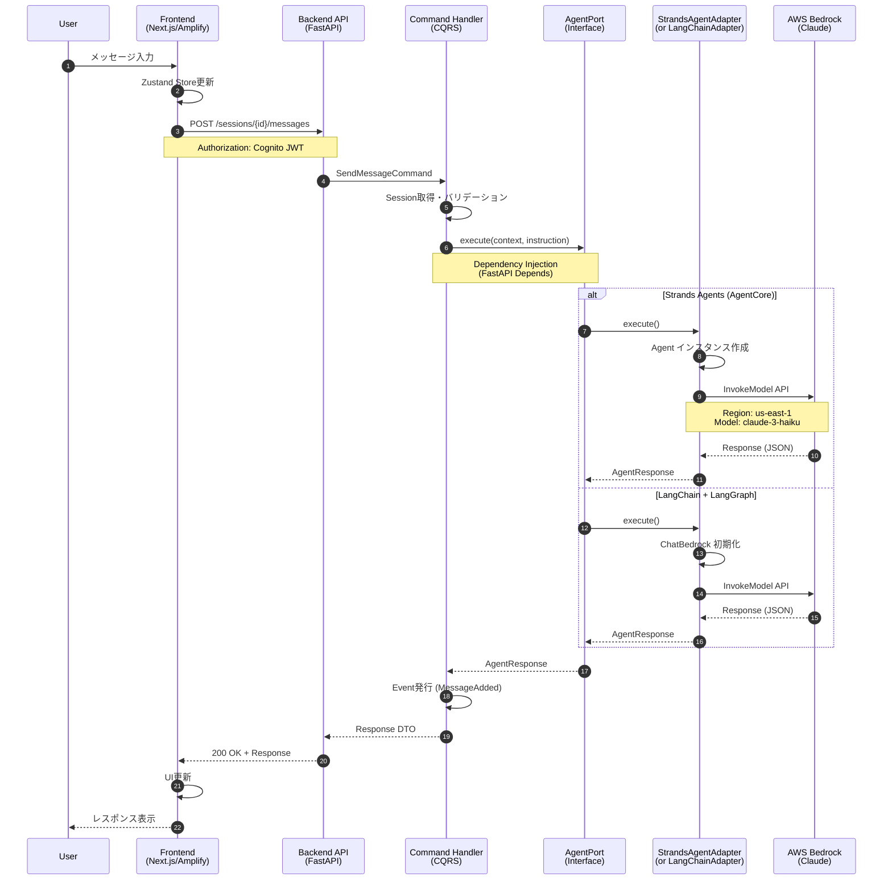
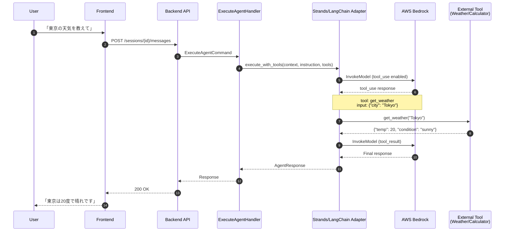
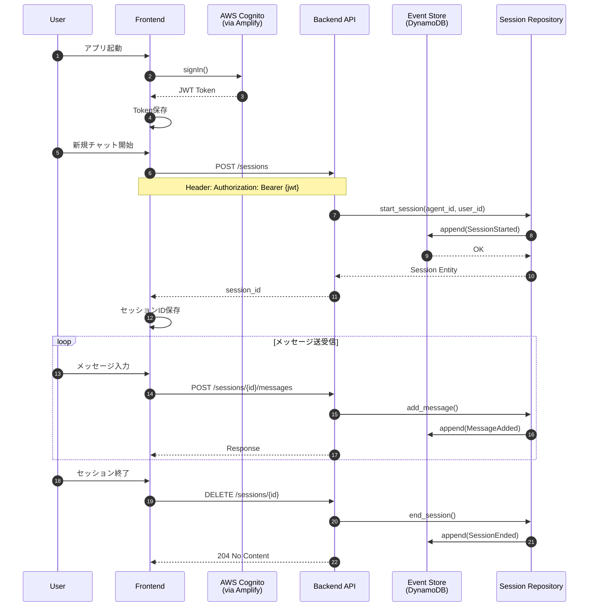
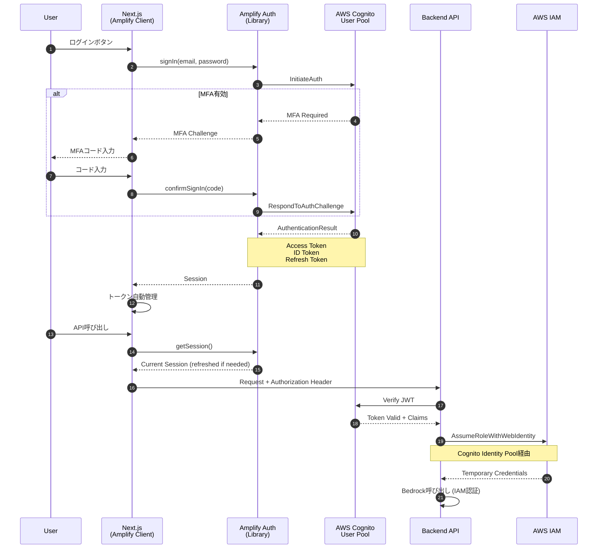
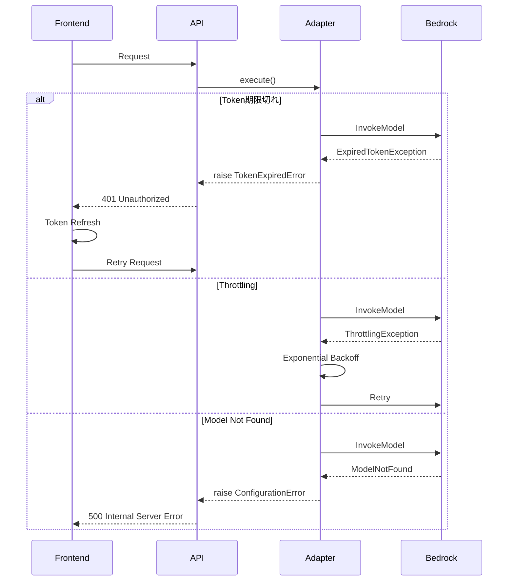

# AWS Bedrock 通信シーケンス図

## 概要

このドキュメントでは、フロントエンドからAWS Bedrockまでの通信フローを示します。

## 全体アーキテクチャ

```
┌─────────────┐     ┌─────────────┐     ┌─────────────┐     ┌─────────────┐
│   Frontend  │────▶│   Backend   │────▶│  PoC Layer  │────▶│AWS Bedrock  │
│  (Next.js)  │◀────│  (FastAPI)  │◀────│ (Adapters)  │◀────│  (Claude)   │
└─────────────┘     └─────────────┘     └─────────────┘     └─────────────┘
```

## シーケンス図

### 1. 基本的なチャットフロー



### 2. ツール付きエージェント実行フロー



### 3. セッション管理フロー



### 4. 認証・認可フロー (Amplify Gen2)



## コンポーネント詳細

### Frontend (Next.js + Amplify Gen2)

```typescript
// Amplify設定
import { Amplify } from 'aws-amplify';
import outputs from '@/amplify_outputs.json';

Amplify.configure(outputs);

// API呼び出し (認証付き)
import { fetchAuthSession } from 'aws-amplify/auth';

async function callApi(endpoint: string, data: any) {
  const session = await fetchAuthSession();
  const token = session.tokens?.idToken?.toString();
  
  return fetch(`${API_URL}${endpoint}`, {
    headers: {
      'Authorization': `Bearer ${token}`,
      'Content-Type': 'application/json',
    },
    body: JSON.stringify(data),
  });
}
```

### Backend (FastAPI)

```python
# JWT検証
from fastapi import Depends, HTTPException
from jose import jwt, JWTError

async def verify_token(token: str = Depends(oauth2_scheme)):
    try:
        payload = jwt.decode(
            token,
            COGNITO_PUBLIC_KEYS,
            algorithms=["RS256"],
            audience=COGNITO_CLIENT_ID,
        )
        return payload
    except JWTError:
        raise HTTPException(status_code=401, detail="Invalid token")
```

### PoC Adapters

```python
# Strands Agents (AgentCore)
from strands import Agent
from strands.models import BedrockModel

model = BedrockModel(
    model_id="anthropic.claude-3-haiku-20240307-v1:0",
    region_name="us-east-1"
)
agent = Agent(model=model)
response = agent(instruction)

# LangChain
from langchain_aws import ChatBedrock

model = ChatBedrock(
    model_id="anthropic.claude-3-haiku-20240307-v1:0",
    region_name="us-east-1"
)
response = await model.ainvoke(messages)
```

## エラーハンドリング



## レイテンシ分析

| ステップ | 想定レイテンシ | 備考 |
|----------|---------------|------|
| Frontend → Backend | 10-50ms | ネットワーク遅延 |
| JWT検証 | 5-20ms | キャッシュ有効時 |
| Handler処理 | 1-5ms | ビジネスロジック |
| Bedrock API呼び出し | 500-3000ms | モデル・プロンプト依存 |
| Response処理 | 1-5ms | シリアライゼーション |
| **合計** | **520-3100ms** | |

## 次のステップ

1. Amplify Gen2でフロントエンド認証を実装
2. Cognito User Pool設定
3. E2Eテスト実行

