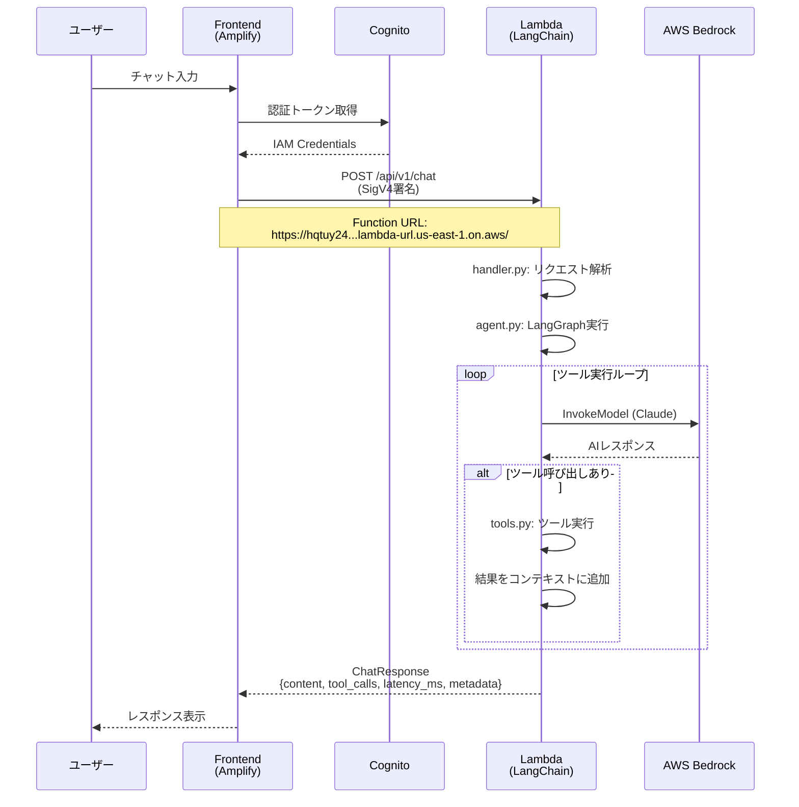
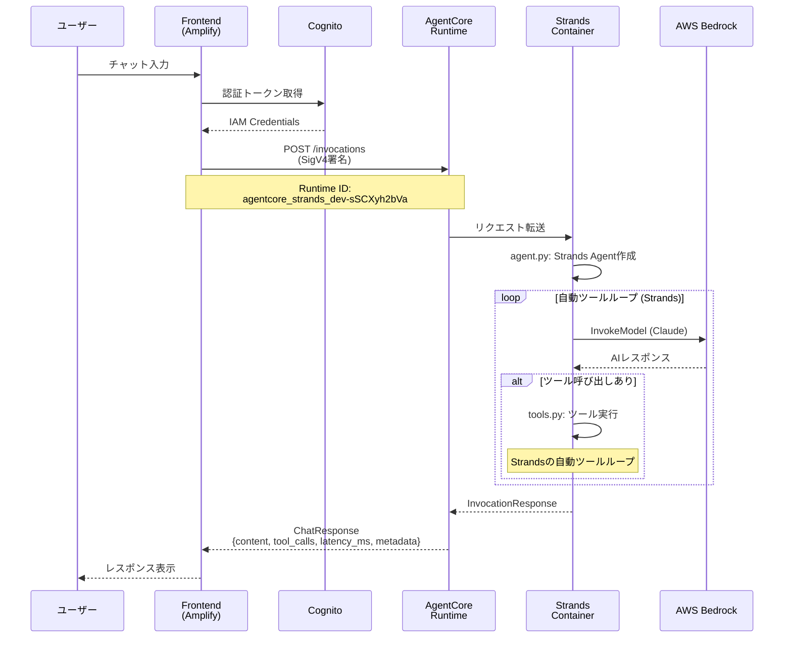
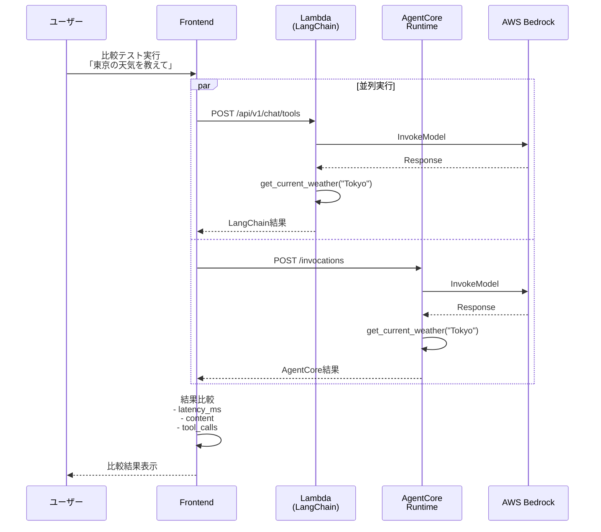
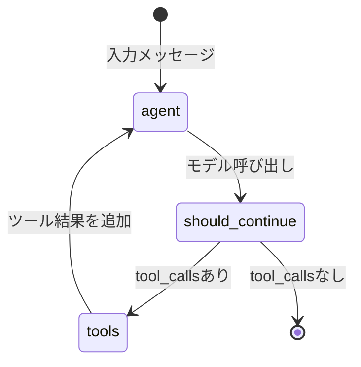
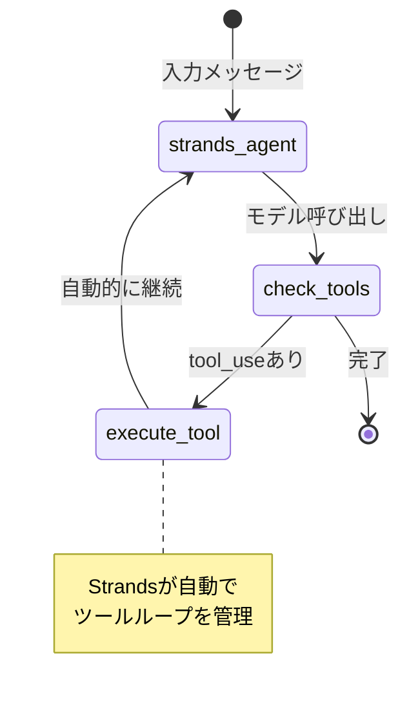
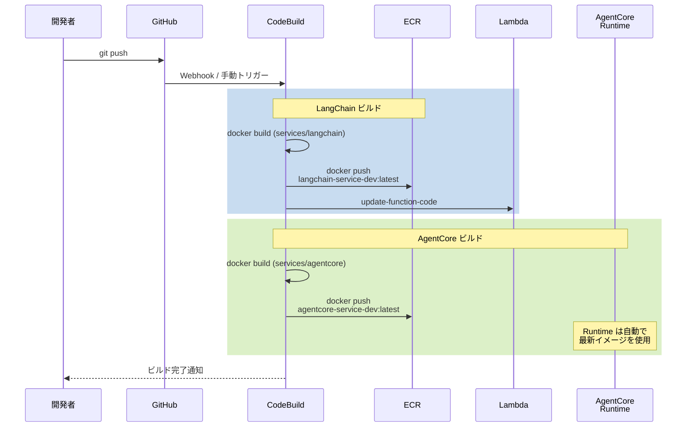

# AgentCore vs LangChain 比較検証 - アーキテクチャ & シーケンス図

## デプロイ状況 (2025-12-22)

### デプロイ済みリソース

| サービス | デプロイ先 | エンドポイント | 認証 |
|---------|----------|---------------|------|
| **LangChain** | Lambda Container | `https://hqtuy24tbjdzbobyg4tzsr2xhe0rjmbx.lambda-url.us-east-1.on.aws/` | AWS_IAM (SigV4) |
| **AgentCore** | AgentCore Runtime | `arn:aws:bedrock-agentcore:us-east-1:226484346947:runtime/agentcore_strands_dev-sSCXyh2bVa` | AWS_IAM |

---

## 全体アーキテクチャ

```
┌─────────────────────────────────────────────────────────────────────────┐
│                              Frontend                                    │
│                         (Amplify + Cognito)                             │
│                                                                          │
│  ┌─────────────────────────────────────────────────────────────────┐    │
│  │                     services-client.ts                           │    │
│  │  ┌──────────────────────┐  ┌───────────────────────────────────┐ │    │
│  │  │ chatWithAgentCore()  │  │ chatWithLangChain()               │ │    │
│  │  └──────────────────────┘  └───────────────────────────────────┘ │    │
│  └─────────────────────────────────────────────────────────────────┘    │
└────────────────────────────────┬────────────────────────────────────────┘
                                 │
                                 │ IAM SigV4 認証
                                 │
          ┌──────────────────────┴──────────────────────┐
          │                                              │
          ▼                                              ▼
┌─────────────────────────────┐        ┌─────────────────────────────────┐
│     AgentCore Runtime       │        │         AWS Lambda              │
│                             │        │     (Container Image)           │
│  ┌───────────────────────┐  │        │  ┌───────────────────────────┐  │
│  │  agentcore_strands_dev│  │        │  │  langchain-service-dev   │  │
│  │                       │  │        │  │                           │  │
│  │  ┌─────────────────┐  │  │        │  │  ┌─────────────────────┐  │  │
│  │  │  Strands Agent  │  │  │        │  │  │ LangChain + LangGraph│  │  │
│  │  │                 │  │  │        │  │  │                      │  │  │
│  │  │  - agent.py     │  │  │        │  │  │  - handler.py        │  │  │
│  │  │  - tools.py     │  │  │        │  │  │  - agent.py          │  │  │
│  │  └────────┬────────┘  │  │        │  │  │  - tools.py          │  │  │
│  │           │           │  │        │  │  └──────────┬───────────┘  │  │
│  └───────────┼───────────┘  │        │  └─────────────┼──────────────┘  │
│              │              │        │                │                 │
└──────────────┼──────────────┘        └────────────────┼─────────────────┘
               │                                        │
               │                                        │
               └────────────────┬───────────────────────┘
                                │
                                ▼
                    ┌───────────────────────┐
                    │    AWS Bedrock        │
                    │                       │
                    │  Claude Sonnet 4      │
                    │                       │
                    └───────────────────────┘
```

---

## チャット実行シーケンス図

### 1. LangChain サービス呼び出し



### 2. AgentCore サービス呼び出し



---

## 比較実行シーケンス図



---

## ツール実行フロー比較

### LangChain (LangGraph StateGraph)



### AgentCore (Strands自動ループ)



---

## デプロイシーケンス (AWS CodeBuild)



---

## 統一API仕様

両サービスは同じAPIインターフェースを実装:

### Request

```json
POST /api/v1/chat
Content-Type: application/json

{
  "instruction": "東京の天気を教えて",
  "session_id": "optional-session-id",
  "use_tools": true
}
```

### Response

```json
{
  "response_id": "uuid",
  "content": "東京の現在の天気は晴れで、気温は22度です。",
  "tool_calls": [
    {
      "tool_name": "get_current_weather",
      "tool_input": {"location": "Tokyo", "unit": "celsius"},
      "tool_output": {"temperature": 22, "condition": "Sunny"}
    }
  ],
  "latency_ms": 1234,
  "metadata": {
    "service": "agentcore|langchain",
    "framework": "strands-agents|langchain + langgraph",
    "model_id": "us.anthropic.claude-sonnet-4-20250514-v1:0",
    "region": "us-east-1"
  }
}
```

---

## 比較評価項目

| 評価項目 | AgentCore (Strands) | LangChain |
|---------|---------------------|-----------|
| **レイテンシ** | latency_ms で測定 | latency_ms で測定 |
| **ツール実行回数** | tool_calls.length | tool_calls.length |
| **応答品質** | content の比較 | content の比較 |
| **コスト** | AgentCore Runtime課金 | Lambda課金 |
| **コールドスタート** | なし (常時起動) | あり (5-15秒) |

---

## 環境情報

```
AWS Account: 226484346947
Region: us-east-1
Model: us.anthropic.claude-sonnet-4-20250514-v1:0

LangChain Service:
  - Lambda Function: langchain-service-dev
  - Function URL: https://hqtuy24tbjdzbobyg4tzsr2xhe0rjmbx.lambda-url.us-east-1.on.aws/
  - ECR: 226484346947.dkr.ecr.us-east-1.amazonaws.com/langchain-service-dev:latest

AgentCore Service:
  - Runtime ID: agentcore_strands_dev-sSCXyh2bVa
  - Runtime ARN: arn:aws:bedrock-agentcore:us-east-1:226484346947:runtime/agentcore_strands_dev-sSCXyh2bVa
  - Endpoint: agentcore_strands_dev_endpoint
  - ECR: 226484346947.dkr.ecr.us-east-1.amazonaws.com/agentcore-service-dev:latest
```

